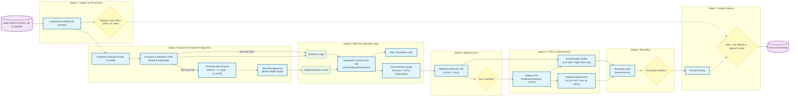

```mermaid
    flowchart LR
    %% Global Styles
    classDef process fill:#e1f5fe,stroke:#01579b,stroke-width:2px;
    classDef decision fill:#fff9c4,stroke:#fbc02d,stroke-width:2px;
    classDef logic fill:#e8f5e9,stroke:#2e7d32,stroke-width:2px,stroke-dasharray: 5 5;
    classDef io fill:#f3e5f5,stroke:#7b1fa2,stroke-width:2px;

    %% INPUTS
    Input[("Input Vectors (32-bit A, B) & Opcode")]:::io --> Unpack
    
    %% STAGE 1: UNPACK & CHECK
    subgraph S1_Unpack ["Stage 1: Unpack & Pre-process"]
        Unpack["Unpacking & Hidden Bit Insertion"]:::process
        SpecialCheck{"Special Case Check<br/>(Zero, Inf, NaN)"}:::decision
    end
    Unpack --> SpecialCheck
    Unpack --> ExpComp
    
    %% STAGE 2: ALIGNMENT
    subgraph S2_Align ["Stage 2: Exponent Compare & Alignment"]
        ExpComp["Exponent Compare (ExpA vs ExpB)"]:::process
        ExpSwap["Exponent & Mantissa Swap<br/>(Route Small/Large)"]:::process
        CalcDiff["Calculate Shift Amount<br/>(Delta E = E_large - E_small)"]:::process
        BarrelShift["Mantissa Alignment<br/>(Barrel Shifter Right)"]:::process
    end
    
    ExpComp --> ExpSwap
    ExpSwap -- "Max Exp Path" --> MantissaLarge
    ExpSwap -- "Min Exp Path" --> CalcDiff --> BarrelShift
    
    %% STAGE 3: EFFECTIVE OPERATION SETUP
    subgraph S3_EffOp ["Stage 3: Effective Operation Logic"]
        MantissaLarge(Mantissa Large):::logic
        MantissaSmall(Aligned Mantissa Small):::logic
        
        ManComp["Magnitude Compare (24-bit)<br/>(Check Aligned Mantissas)"]:::process
        SignLogic["Sign Calculation Logic"]:::process
        ManSwapFinal["Final Mantissa Swap<br/>(Ensure A > B for Subtraction)"]:::process
    end

    BarrelShift --> MantissaSmall
    ExpSwap --> MantissaLarge
    
    MantissaLarge --> ManComp
    MantissaSmall --> ManComp
    ManComp --> ManSwapFinal
    ManComp --> SignLogic
    
    %% STAGE 4: EXECUTION
    subgraph S4_ALU ["Stage 4: Mantissa ALU"]
        ALU["Add/Sub Arithmetic Unit<br/>(24-bit + Carry)"]:::process
        OverflowCheck{"ALU Overflow?"}:::decision
    end
    
    ManSwapFinal --> ALU
    ALU --> OverflowCheck
    
    %% STAGE 5: NORMALIZATION
    subgraph S5_Norm ["Stage 5: LOPD & Normalization"]
        LOPD["Leading One Prediction/Detection (LOPD)"]:::process
        ExpAdjust["Exponent Adjustment<br/>(Inc for OVF / Dec for Norm)"]:::process
        NormShift["Normalization Shifter<br/>(Left Shift / Right Shift 1-bit)"]:::process
    end
    
    OverflowCheck --> LOPD
    ALU --> NormShift
    LOPD --> ExpAdjust
    LOPD --> NormShift
    
    %% STAGE 6: ROUNDING
    subgraph S6_Round ["Stage 6: Rounding"]
        RoundLogic["Rounding Logic<br/>(Nearest Even)"]:::process
        PostRoundNorm{"Rounding Overflow?"}:::decision
    end
    
    NormShift --> RoundLogic
    ExpAdjust --> RoundLogic
    RoundLogic --> PostRoundNorm
    
    %% STAGE 7: OUTPUT MUX
    subgraph S7_Out ["Stage 7: Output Packing"]
        ResultPack["Result Packing"]:::process
        FinalMux{"Mux: Calc Result vs Special Cases"}:::decision
    end
    
    PostRoundNorm --> ResultPack
    SpecialCheck -.-> FinalMux
    ResultPack --> FinalMux
    
    Output[("Final 32-bit Result")]:::io
    FinalMux --> Output

    %% Citations to code modules
    %% Note: These link mentally to the uploaded file modules:
    %% S2 -> ADD_SUB_EXP_comp, ADD_SUB_SHF_right
    %% S3 -> ADD_SUB_COMP_24bit
    %% S4 -> ADD_SUB_MAN_ALU
    %% S5 -> ADD_SUB_LOPD_24bit, ADD_SUB_NOR_unit
    %% S6 -> ADD_SUB_MAN_rounding
```